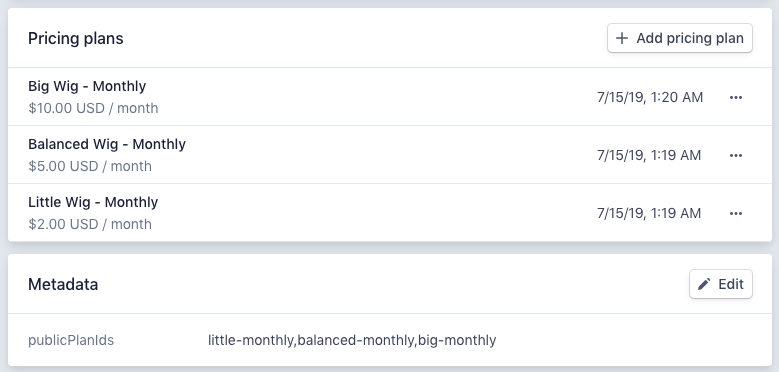
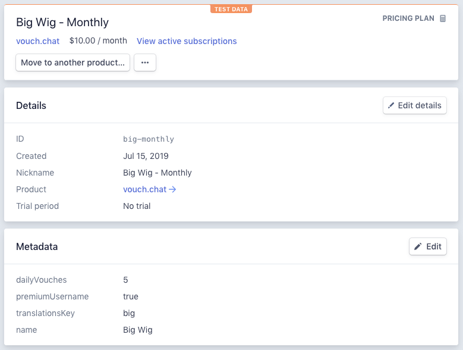

vouch.chat
==========

**The responsible social network.**

This repository contains the source code for [Vouch](https://vouch.chat) -- a social network that is:

- Ad free
- Member supported, and
- 100% open source

You probably already know why [it's crucial that a responsible social network is ad-free and member supported](). But why should it be open source?


Building an ad-free internet
----------------------------

Vouch's mission is to move the world towards an ad-free internet, and the vouch.chat social network is just one small part of that. To get to our goal, there're thousands of other member supported services which need to be built, and business cases that need to be closed. We can't do this all on our own, but what we *can* do is to give *you* the support that you need to build your own member-supported service -- and hopefully help you make some serious bacon on the side.

That's why we're releasing the Vouch source code -- it's a foundation for you to build on. It has everything you need to spin up an app that can accept real payments, with a simple serverless architecture that's built on:

- Create React App,
- Firebase, and
- Stripe

We *want* you to make bacon with this -- and that's why the source is MIT-licensed. If you're familiar with these tools, then all you need to do is `git clone` and get going.

```
git clone https://github.com/frontarm/vouch.chat
```

But say you'd like a little more help figuring it all out?


React, Firebase & Bacon
-----------------------

Along with the source code, the Vouch team is also developing a course with a goal of walking you through the construction and architecture of this codebase -- from `npm init` through to credit card payments.

The course, like this repository, is a living document. It receives regular updates, with new content prioritized based on member feedback. For less than the cost of a latte a month, you'll gain access to all exclusive content, along with a members-only slack room. If you're serious about makin' bacon, then you owe it to yourself to [try out React, Firebase & Bacon](https://frontarm.com/bacon).


Running and Deploying Vouch
---------------------------

So you want to get Vouch running locally and then deploy your own copy? Here's how.

### 1. Accounts

Before starting, you'll need accounts with a couple of services:

- Firebase (with a plan that allows for communication with external APIs, like the *Blaze* plan)
- Stripe

Once you have these accounts, you'll need to prepare the following information:

- Your Firebase config object (which you can find in the Firebase console)
- A Firebase service account JSON file (which you can create in the Firebase console under Project Settings / Service accounts) 
- A Stripe test api key, secret key, webhook secret and product id


#### Setting up your Stripe Product

Vouch reads the available product plans directly from Stripe. It expects that all available plans will be created under the same Product object, and looks for a list of available plans under the product metadata's `publicPlanIds` key.

Here's what the relevant settings look like for Vouch itself:



Vouch also reads plan information from each plan's metadata. Here's an example of what this configuration looked like at the time of writing:




### 2. Clone and install

Once you've got the config ready, start by cloning the repository and installing its dependencies. Vouch manages its dependencies with [yarn](https://yarnpkg.com/en/), but npm may work too.

```bash
git clone git@github.com:frontarm/vouch.chat.git vouch
cd vouch
yarn install
cd functions
yarn install
cd ..
```


### 3. Local configuration files

To run the app locally, you'll need to create some configuration files.

```bash
cp .env.example .env.development.local
cp functions/.runtimeconfig.json.example functions/.runtimeconfig.json
```

You'll then need to fill in these files with the settings you prepared earlier:

- Add your Stripe configuration to `.runtimeconfig.json`
- Add your Firebase config and Stripe public key to `.env.development.local`

The end result should look something like this:

```js
// .runtimeconfig.json
{
  "stripe": {
    "product_id": "prod_lololololololo",
    "secret_key": "sk_test_lololololololololololololololololo",
    "webhook_secret": "whsec_lolololololololololololololololo"
  }
}

// .env.development.local files
REACT_APP_FIREBASE_API_KEY=lolololololololo_lololololololololololo
REACT_APP_FIREBASE_AUTH_DOMAIN=something.firebaseapp.com
REACT_APP_FIREBASE_DATABASE_URL=https://something.firebaseio.com
REACT_APP_FIREBASE_PROJECT_ID=something
REACT_APP_FIREBASE_STORAGE_BUCKET=something.appspot.com
REACT_APP_FIREBASE_MESSAGING_SENDER_ID=111111111111
REACT_APP_FIREBASE_APP_ID=1:111111111111:web:1lololololololol

REACT_APP_STRIPE_API_KEY=pk_test_lololololololololololololololololo
```

You'll also need to copy your firebase service account JSON file to `functions/.serviceaccount.json`

The configuration files are all listed in `.gitignore`, so that you don't accidentally push any configuration to a public repository.


### 4. Link a firebase app

The Firebase CLI tool looks for the current project's app ID in a file could `.firebaserc` -- which you'll need to create. The easiest way to do this is by running `firebase use --add`, selecting a project, and then naming it `default` when prompted:

```
$ firebase use --add

? Which project do you want to add? vouchchat
? What alias do you want to use for this project? (e.g. staging) default

Created alias default for vouchchat.
Now using alias default (vouchchat)
```


### 5. Start the dev server

You can test your configuration by starting the development server:

```bash
yarn start
```

This *should* open a browser window to <http://localhost:3000/>, which *should* display the landing page.


### 6. Configuration for deployment

Before deploying your app, you'll first need a `.env.production.local` file. This follows the same format as `.env.development.local` -- in fact, you can just copy the development settings across unless you're launching you own production app.

You'll also need to set the production config for your Firebase functions:

```bash
firebase functions:config:set stripe.product_id=... stripe.secret_key=... stripe.webhook_secret=...
```

The reason you'll need to do this is that the information in `functions/.runtimeconfig.json` is only used locally; the `firebase functions:config:set` command is used to configure the same settings for production.


### 7. Deploy!

Deploying your app to the internets is simple:

```bash
yarn deploy
```

This will build your app's distributable files and renderer package with `universal-react-scripts`, then deploy these to Firebase Hosting/Functions -- along with the Firebase functions that constitute the API. Once complete, the app's URL will be printed to the console.


### 8. Setting up Webhooks

To keep the Firebase database up to date with the latest subscription data, you'll need to set up a Stripe webhook in the stripe Developers / Webhooks panel.

The webhook URL will take the following format:

```
https://us-central1-<your firebase project id>.cloudfunctions.net/webhooks-stripe
```

The webhook will in turn call the function in `functions/webhooks/stripe.js`, which handles the following events:

- `invoice.created`
- `customer.subscription.deleted`
- `customer.subscription.updated`


License
-------

Vouch's source code, other than the files in `/src/media`, are licensed under the [MIT license](/LICENSE.md).

Files under `/src/media` are not licensed for use without explicit permission. Please get in touch at [hello@vouch.chat](mailto:hello@vouch.chat) if you'd like to use the Vouch brand in your project (or if you'd like to help us improve our license).